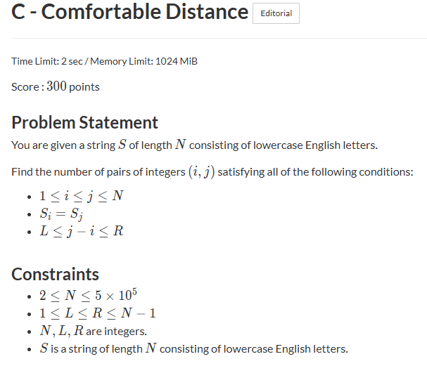
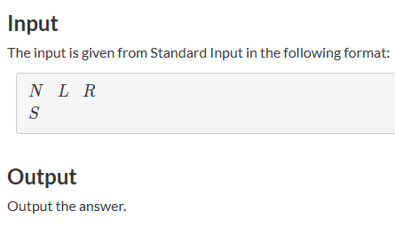

# PS Retrospective Template

## 1) 문제 기본 정보




## 2) 나의 풀이
- 날짜: 260314
- 풀이 횟수: 1
### 아이디어
- 접근 전략
```text
브루트포스 생각함. 각 문자마다 L~R까지 검사하며 pair개수 세기.
N이 10^5까진데 완탐으로 하면 O(N^2)이라 TLE 예상함.

투포인터도 생각해봤으나 아닌거같아서 패스함.
```
- 왜 이 방법을 먼저 떠올렸는지
```text
제일 직관적임. 시간 터질거 알지만 적절한 알고리즘 안떠오름.
```
- 코드
```C++
#include <iostream>
#include <vector>
using namespace std;

int main(){
    ios_base::sync_with_stdio(false);
    cin.tie(nullptr);

    int n, l, r;
    vector<char> letter;

    cin >> n >> l >> r;
    while(n--){
        char c;
        cin >> c;
        letter.emplace_back(c);
    }
        
    int ans = 0;
    for(auto it = letter.begin(); it!=letter.end(); ++it){
        int gap = it - letter.begin();
        for(auto i=letter.begin()+gap+l; i!=letter.begin()+gap+r+1; ++i){
            if(i == letter.end()) break;
            if(*it == *i) ans++;
        }
    }

    cout << ans;
}
```

### 구현 포인트
- 사용한 자료구조/알고리즘: Brute Force
- 시간복잡도: O(N^2)
- 코드에서 실수하기 쉬운 부분: 이중 for문에서 i가 letter의 범위 초과
- 까다로웠던 제약 또는 edge case:

### 결과
- 제출 횟수: 1
- 제출 결과(AC/WA/TLE/MLE/RE): RE+TLE
- 틀린 원인: 인덱스 범위 초과 + 시간초과
- 수정 내용:


## 3) 표준 풀이
### 핵심 아이디어
- 정석 접근
```text
투포인터가 맞았음;; 근데 이제 누적합을 곁들인
R길이의 쌍 개수에서 (L-1)길이의 쌍 개수 빼면 됨.
S 순회하면서 26크기의 배열에 각 알파벳 개수 업데이트
total에 순회중인 알파벳 개수(=쌍 개수) 추가
```
- 코드
```C++
#include <iostream>
#include <vector>
#include <string>
using namespace std;

long long n, l, r;
string s;

long long count_pairs(int k){
    if(k <= 0) return 0;

    long long total = 0;
    vector<int> freq(26, 0);

    for(int i=0; i<n; ++i){
        total += freq[s[i] - 'a'];
        freq[s[i] - 'a']++;
        if(i >= k)
            freq[s[i-k] - 'a']--;
    }
    return total;
}
int main(){
    ios_base::sync_with_stdio(false);
    cin.tie(nullptr);

    cin >> n >> l >> r >> s;
    cout << count_pairs(r) - count_pairs(l-1);
}
```

### 구현 포인트
- 필수 자료구조/기법: Sliding Window
- 시간복잡도: O(N)
- 구현 시 주의점:

### 나와 다른 점
- 발상 차이: 투포인터를 누적합 개념과 함께 쓸 수도 있다.
- 구현 차이: 다
- 성능 차이: 


## 4) 회고
- 이번 문제에서 얻은 핵심 1가지: 투포인터는 양 끝에서 모으는 기법이 다가 아님.
- 다음에 비슷한 문제를 보면 확인할 체크리스트:
	
	<키워드>
	- 연속된
	- 부분 배열/문자열
	- 최대/최소 길이
	- 쌍의 개수

	<슬라이딩 윈도우 문제 유형>
	- 길이가 K인 구간의 최대 합 구하기
	- 문자열에서 특정 문자가 포함된 가장 짧은 구간
	- 거리가 K 이내인 문자 쌍 개수
	
	<투 포인터 유형>
	
	a. 같은 방향에서 시작
	- 구간의 합이나 조건 맞추기
	
	b. 양 끝에서 시작
	- 정렬된 수열에서 두 수의 합이 K가 되는 쌍 개수
